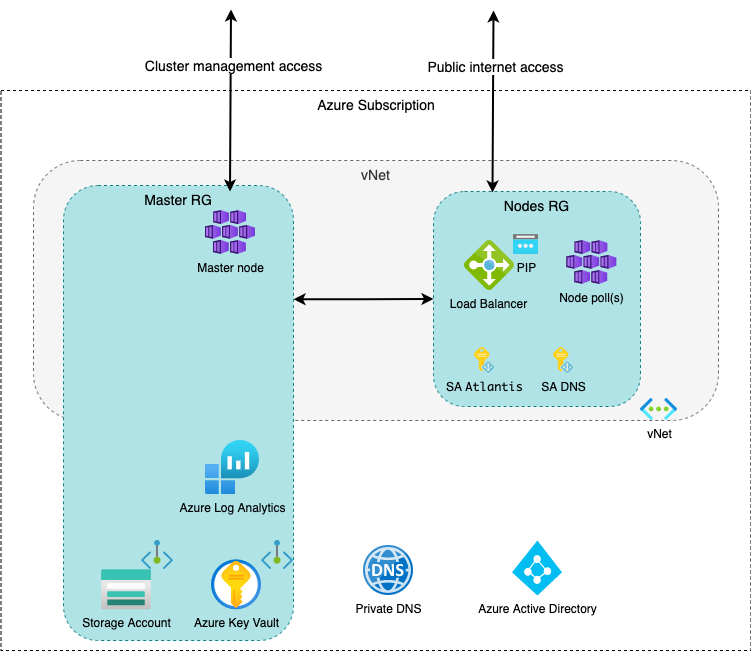

# Welcome to the CG-DEVX Azure module

This complex module allows you to deploy both a simple configuration in the form of an almost empty kubernetes cluster,
and a more complex solution that is more suitable for production.
By default, the firewall configuration is enabled, which is open to the public Internet by Public IP, and the cluster
behind it. A more detailed description of the architecture will be in the corresponding chapter.

This configuration is capable of running on a new Azure subscription and uses a mini cluster configuration.

## Prerequisites

- **[AZ tool](https://learn.microsoft.com/en-us/cli/azure/install-azure-cli)** is required for full-fledged work.

- Kubernetes command-line tool (**[kubectl](https://kubernetes.io/releases/download/)**)

- After you need to connect to your Azure subscription using *
  *[az tool](https://learn.microsoft.com/en-us/azure/developer/terraform/get-started-cloud-shell-bash?tabs=bash#authenticate-to-azure-via-a-microsoft-account)
  **

-
    *
*[Azure service principal](https://learn.microsoft.com/en-us/azure/developer/terraform/get-started-cloud-shell-bash?tabs=bash#create-a-service-principal)
**
We can use a different authentication method for terraforms, but the Principal service is considered the most optimal.
Service Principal is created with Contributor rights for the entire subscription.
(Optional) Add the User Access Administrator role for the service principal.

To successfully connect to the cluster, you need to install the **kubelogin** tool. You can use *
*[THIS](https://azure.github.io/kubelogin/install.html)**) guide to install.

## Usage

- Add service principal data to the main file (inside provider block) or environment parameters(or other *
  *[options](https://learn.microsoft.com/en-us/azure/developer/terraform/authenticate-to-azure?tabs=bash#terraform-and-azure-authentication-scenarios)
  **)

- Add your public ssh key to the variable **"ssh_public_key"** inside of the main variable file.

- Navigate to the /cg-devx-core/platform/terraform/hosting_provider/ folder (or cd ../../hosting_provider/ if you're in
  the cloud_azure folder).

- You can change a small number of variables inside the main.ft file, for example: region, cluster_name etc. You can
  find more parameters in the folder with the module - cloud_azure.

- Run terraform

## How to connect to AKS cluster

After successfully deploying the code, you will be able to *
*[connect to your cluster](https://learn.microsoft.com/en-us/azure/architecture/guide/security/access-azure-kubernetes-service-cluster-api-server#access-the-aks-cluster-over-the-internet)
**.
By default, the credentials are merged into the .kube/config file so kubectl can use them. **For full access to the AKS
cluster, you need to get administrator credentials**

> az aks get-credentials --name devxaks --resource-group devxaks-rg --admin

If you are using the default settings, you need to run:
> az aks get-credentials --name DevXAks --resource-group DevX-rg

After that, your kubeconfig will be updated automatically.

## AKS RBAC

To provide access to certain roles and access to resources for System Accounts of the AKS cluster, we use

*

*[workload identities](https://learn.microsoft.com/en-us/azure/active-directory/workload-identities/workload-identities-overview)
**.
Short manual you can find *
*[here](https://dev.to/maxx_don/implement-azure-ad-workload-identity-on-aks-with-terraform-3oho)**.

This code creates a workload identity for a service account that is located in the AKS cluster and gives it rights to
the current subscription.
During creation, you dont need to have a Service Account or create it immediately. To create RBAC, you need to add a new
value to the main variables.tf to variable **service_accounts**

```
variable "service_accounts" {
  description = "Specifies the AKS SA names and roles."
  type        = map(any)
  default = {
    sa_1 = {
      name = "account_name"
      role_definitions = [{
        "name"  = "First Role",
        "scope" = ""
      }]
      service_account_name = "sa_name"
      namespace            = "namespace-ns"
    }
  }
}
```

Here you will need to indicate the account name, service account name, namespace name, role name, scope.
If the scope is blank, this means that the role will be issued immediately to the **entire subscription** to which the
deployment is made. This has meaning at the level of the contractor or reader.
If you need to specify a specific resource that requires a certain type of access, the scope must begin with a slash /

Here is an example for a scope for one virtual machine:
/resourceGroups/**RG_NAME**/providers/Microsoft.Compute/virtualMachines/**VM_NAME**

If you need to add more than one role, you need to add another block:

```
      role_definitions = [{
        "name"  = "One more role",
        "scope" = "/resourceGroups/RG_NAME/providers/Microsoft.Compute/virtualMachines/VM_NAME"
      }]
```

All existing roles you can find *
*[here](https://learn.microsoft.com/en-us/azure/role-based-access-control/built-in-roles)**.
You can use a custom role, but it must be created first.

## Architecture

The architecture of the AKS cluster complies with the recommended Microsoft parameters.
By default, the cluster and all resources are located in the West Europe region (except global
resources). A master node of the cluster is created in the main resource group, all node groups are created in separate
group.

In addition, in the main resource group, the resources necessary for cluster orchestration are created, namely:

- Storage Account (for collecting logs, state terraforms, etc.)
- Kay Volt (for storing secrets, keys, etc.)
- Private DNS (for accessing resources using hostnames)
- Log Analytics (for logs and metrics. Will be replaced by Azure Monitor).

Resourse group with working nodes contains nodes, a load balancer (standard tier) and a public IP address (static). The
IP address is assigned to the load balancer and is used to access the cluster content. The load balancer acts as an
ingress controller. In addition, the group contains identity management roles for cluster access to Azure subscription
resources.

Storage account and key volt will be accessible only from the internal network.
